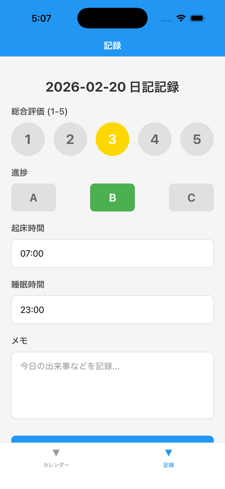

# Diary App

A mobile diary app for tracking daily ratings, progress, wake-up/sleep times, and memos with GitHub-style calendar heatmap visualization.


## Features

### Mobile App (React Native)

- 📝 **Daily Entry Recording** (Rating 1-5, Progress A/B/C, Time, Memo)
- 📅 **Calendar Heatmap** (GitHub-style visualization)
- 💾 **Local Storage** (AsyncStorage)
- 🔄 **Tab Navigation** (Calendar / Entry)

### Backend API (Go)

- 📊 RESTful API
- 🗄️ MySQL Database
- 📈 Statistics (Summary, Trend)
- 🗓️ Calendar Data Endpoints

## Screenshots

### Entry Screen


- Select rating (1-5) with circular buttons
- Choose progress (A/B/C)
- Input wake-up and sleep times
- Add memo (optional)
- Save your entry

### Calendar Screen


- GitHub-style heatmap with green color intensity
- Tap any date to view details or record entry
- Color legend for rating levels

## Tech Stack

### Frontend

- React Native 0.81.5
- Expo 54
- React Navigation
- react-native-calendars
- AsyncStorage

### Backend

- Go 1.22+
- Gin Web Framework
- MySQL 8
- go-sql-driver/mysql

## Directory Structure

```
260219-diary-app/
├── App.js                    # React Native entry point
├── src/
│   ├── navigation/           # Tab navigation
│   ├── screens/              # Screens
│   ├── components/           # Components
│   ├── services/             # Data persistence
│   └── utils/                # Utilities
├── server/                   # Go backend
│   ├── cmd/api/              # Entry point
│   ├── internal/
│   │   ├── handler/          # HTTP handlers
│   │   ├── service/          # Business logic
│   │   ├── model/            # Data models
│   │   └── config/           # Configuration
│   └── Makefile              # Dev commands
└── API_SPEC.md               # API specification
```

## Setup

### Frontend

```bash
# Install dependencies
npm install

# Start development server
npx expo start
```

Scan QR code with Expo Go app.

### Backend

```bash
cd server

# Start MySQL
make mysql-up

# Start server
make run
```

See [server/README.md](./server/README.md) for details.

## API Documentation

See [API_SPEC.md](./API_SPEC.md) for complete API specification.

## Usage

### Recording a Diary Entry

1. Open "Entry" tab
2. Select rating (1-5)
3. Choose progress (A/B/C)
4. Enter wake-up and sleep times
5. Add memo (optional)
6. Tap "Save"

### Viewing Calendar

1. Open "Calendar" tab
2. Recorded days shown in green shades
3. Tap any date to view details

## Heatmap Color Guide

| Rating | Color |
|--------|-------|
| None   | Gray |
| 1      | Light Green |
| 2      | Medium Green |
| 3      | Dark Green |
| 4      | Darker Green |
| 5      | Darkest Green |

## Development

```bash
# Frontend
npm install           # Install dependencies
npx expo start        # Start dev server

# Backend
cd server
make build            # Build
make test             # Test
make fmt              # Format
```

## Roadmap

- [ ] User Authentication
- [ ] Data Sync (Local ↔ Server)
- [ ] Graph Visualization
- [ ] Export Feature
- [ ] Dark Mode

## License

MIT

## Author

[nana743533](https://github.com/nana743533)
